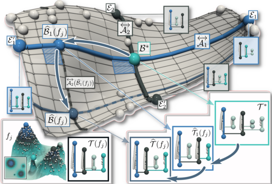
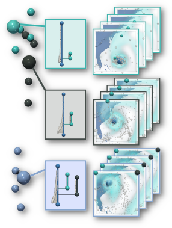

<style type="text/css">
.main-container {
  max-width: 60em;
  margin-left: auto;
  margin-right: auto;
}
body {
  color: rgb(242, 255, 255);
  background-color: rgb(42.3, 46.8, 53.1);
}
a {
  color: rgb(77, 230, 230) !important;
}
.nav-pills>li>a {
   color: rgb(242, 255, 255) !important;
}
.nav-pills>li>a:hover, .nav-pills>li>a:focus, .nav-pills>li.active>a, .nav-pills>li.active>a:hover, .nav-pills>li.active>a:focus{
   color: rgb(22, 26.5, 26.5) !important;
   background-color: rgb(180, 190, 195) !important;
}
</style>

<!--
###############################################################################
-->

```{r out.width='17.5%', out.extra='style="border-radius: 15px; float:right; padding:0px; margin-top: 16.5px; margin-left:6px; margin-right:6px"', echo=FALSE}

```

<div style="border-radius: 15px; background-color:rgb(180, 190, 195); text-align: center; color:rgb(52, 56.5, 56.5); width:57.9em; max-width:57.9em; height:14em; max-height:14em">
<br /><br />
<span style="margin-left: 110px; font-weight: 600"> <font size="5">Mathieu Pont</font>

<span style="margin-left: 110px;">CNRS - Sorbonne Université (LIP6)</span>

*<span style="margin-left: 110px;">[name].[surname][at]lip6.fr</span>*
<br /><br /><br /><br />
</div>

### About

I am currently a PhD Student, since October 2020, at CNRS Sorbonne Université (LIP6) within the [TORI project](https://erc-tori.github.io/). 

My thesis, directed by [Julien Tierny](https://julien-tierny.github.io/), focuses on Topological Data Analysis, especially in the analysis on an ensemble of merge trees with applications in machine learning, visualization and data reduction.

I did my master degree at Paris Descartes University (now Université Paris Cité) in the "Machine Learning for Data Science" track.

## {.tabset .tabset-fade .tabset-pills}

### <font size="4">Research</font>

<br />

```{r out.width='26.5%', out.extra='style="float:left; padding:10px"', echo=FALSE}

```

**<span style="color:rgb(153, 200, 250); margin-left: 20px">Principal Geodesic Analysis of Merge Trees (and Persistence Diagrams)</span>**

<span style="margin-left: 20px"> Mathieu Pont, Jules Vidal, Julien Tierny

<span style="margin-left: 20px"> IEEE Transactions on Visualization and Computer Graphics

<span style="margin-left: 20px"> Accepted, 2022.

<span style="margin-left: 20px"> [Paper](https://arxiv.org/pdf/2207.10960.pdf) - [Code](https://github.com/MatPont/MT-PGA) - [Data](https://github.com/MatPont/WassersteinMergeTreesData) - [Replicability Stamp](http://www.replicabilitystamp.org/#https-github-com-matpont-mt-pga)

<br />

```{r out.width='26.5%', out.extra='style="float:left; padding:10px"', echo=FALSE}

```

<br />

<br />

**<span style="color:rgb(153, 200, 250); margin-left: 20px">Wasserstein Distances, Geodesics and Barycenters of Merge Trees</span>**

<span style="margin-left: 20px"> Mathieu Pont, Jules Vidal, Julie Delon, Julien Tierny

<span style="margin-left: 20px"> IEEE Transactions on Visualization and Computer Graphics

<span style="margin-left: 20px"> Proc. of IEEE VIS 2021.

<span style="margin-left: 20px"> [Paper](https://arxiv.org/pdf/2107.07789.pdf) - [Code](https://github.com/MatPont/WassersteinMergeTrees) - [Data](https://github.com/MatPont/WassersteinMergeTreesData) - [Replicability Stamp](http://www.replicabilitystamp.org/#https-github-com-matpont-wassersteinmergetrees) - [Talk](https://www.youtube.com/watch?v=M5fUzDpm3kY)

<br />

<!--
## Data

### SciVis contest ensemble data
-->


<!--===========================================================================-->
<!--===========================================================================-->
<!--===========================================================================-->
### <font size="4">Talks</font>

##### 2023

- Oct. 16th, [Pre-VIS Day](https://www.aviz.fr/Events/Previs2023) - "Principal Geodesic Analysis of Merge Trees (and Persistence Diagrams)"

- Jun. 23rd, [Journée APR](https://www-apr.lip6.fr/web/doku.php?id=apr:journees:ete2023) - "Analyse en Géodésiques Principales d'Arbres de Fusion (et de Diagrammes de Persistance)"  

- Jun. 22nd, [Journée Visu 2023](https://journee-visu.github.io/2023/) - "Analyse en Géodésiques Principales d'Arbres de Fusion (et de Diagrammes de Persistance)"

- Jun. 8th, [CORESA 2023](https://coresa2023.sciencesconf.org/) - "Analyse en Géodésiques Principales d'Arbres de Fusion (et de Diagrammes de Persistance)"  
*Best Paper and Presentation Award!*

##### 2022

- Nov. 25th, [JFIG 2022](https://project.inria.fr/jfig2022/) - "Distances de Wasserstein, Géodésiques et Barycentres d'Arbres de Fusion"

- Oct. 17th, [IEEE VIS 2022](http://ieeevis.org/year/2022/welcome) - "Tutorial: Wasserstein Distances, Barycenters and Clusters of Merge Trees in TTK" - [Talk](https://youtu.be/ny0kgoMbOfg?t=10755)

- Jun. 28th, [Journée Visu 2022](https://journee-visu.github.io/2022/) - "Distances de Wasserstein, Géodésiques et Barycentres d'Arbres de Fusion"

##### 2021

- Oct. 28th, [IEEE VIS 2021](http://ieeevis.org/year/2021/welcome) - "Wasserstein Distances, Geodesics and Barycenters of Merge Trees" - [Talk](https://www.youtube.com/watch?v=M5fUzDpm3kY)


<!--===========================================================================-->
<!--===========================================================================-->
<!--===========================================================================-->
### <font size="4">Awards</font>

##### 2023

- Best Paper and Presentation Award at [CORESA 2023](https://coresa2023.sciencesconf.org/)  
*For the talk: "Analyse en Géodésiques Principales d'Arbres de Fusion (et de Diagrammes de Persistance)"*


<!--===========================================================================-->
<!--===========================================================================-->
<!--===========================================================================-->
### <font size="4">Teaching</font>

##### 2022 - 2023

- [Elements de Programmation 1](http://licence.premiereannee.sorbonne-universite.fr/fr/la-licence-1ere-annee/liste-des-ue/lu1in001-element-de-programmation-i.html) - Licence 1 (Python) : ~20h TD, ~20h TP

- [Structures de Données]() - Licence 2 (C) : ~20h TP

##### 2021 - 2022

- [Elements de Programmation 1](http://licence.premiereannee.sorbonne-universite.fr/fr/la-licence-1ere-annee/liste-des-ue/lu1in001-element-de-programmation-i.html) - Licence 1 (Python) : ~20h TD, ~20h TP

- [Introduction à la Visualisation Scientifique](https://julien-tierny.github.io/visualizationClass.html) - Master 2 (ParaView/C++) : ~20h TP

##### 2020 - 2021

- [Introduction à la Visualisation Scientifique](https://julien-tierny.github.io/visualizationClass.html) - Master 2 (ParaView/C++) : ~20h TP

- [Elements de Programmation 2](http://licence.premiereannee.sorbonne-universite.fr/fr/la-licence-1ere-annee/liste-des-ue/lu1in002-informatique-2.html) - Licence 1 (C) : ~40h TP

## {-}
