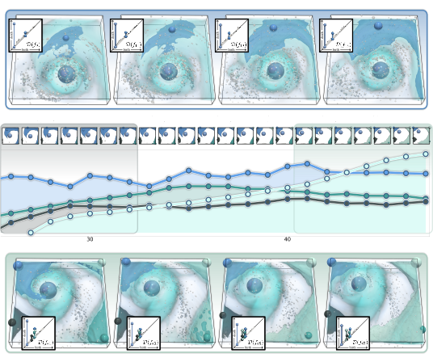
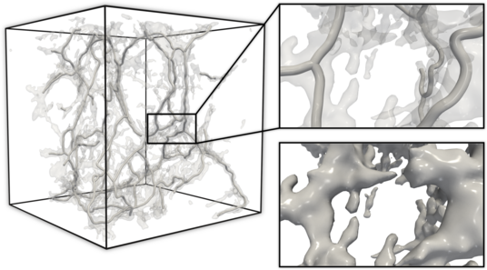

<style type="text/css">
.main-container {
  min-width: 800px;
  max-width: 800px;
  margin-left: auto;
  margin-right: auto;
}
body {
  color: rgb(242, 255, 255);
  background-color: rgb(38.1, 42.1, 47.8);
}
a {
  color: rgb(77, 230, 230) !important;
}
.nav-pills>li>a {
   color: rgb(242, 255, 255) !important;
}
.nav-pills>li>a:hover, .nav-pills>li>a:focus, .nav-pills>li.active>a, .nav-pills>li.active>a:hover, .nav-pills>li.active>a:focus{
   color: rgb(22, 26.5, 26.5) !important;
   background-color: rgb(180, 190, 195) !important;
}

/* CSS for research papers */
.container {
    display: flex;
    align-items: center;
    /*margin-left: 0;*/
    margin: 0 auto;
    justify-content: left;
    min-width: 735px;
    max-width: 735px;
    background-color: rgb(59.51, 64.7, 70.84);
    border-radius: 10px;
}
.image {
    width: 14em;
    height: auto;
}
.text {
    margin-top: 10px;
    margin-left: 30px;
}
</style>

<!--===========================================================================-->
<!--===========================================================================-->
<!--===========================================================================-->

```{r out.width='17.5%', out.extra='style="border-radius: 15px; float:right; padding:0px; margin-top: 16.5px; margin-left:6px; margin-right:-22px"', echo=FALSE}
knitr::include_graphics("img/PONT_photo.jpg")
```

<div style="border-radius: 15px; background-color:rgb(180, 190, 195); text-align: center; color:rgb(52, 56.5, 56.5); min-width:800px; max-width:800px; height:13.35em; max-height:13.35em">
<div style="height: 30px;"></div>
<span style="margin-left: 110px; font-weight: 600"> <font size="5">Mathieu Pont</font>

<span style="margin-left: 110px;">RPTU Kaiserslautern-Landau</span>

<span style="margin-left: 110px;">Scientific Visualization Lab</span>

*<span style="margin-left: 110px;">[name].[surname][at]outlook.com</span>*
<br /><br /><br /><br />
</div>

### About

I currently have a post-doctoral position, since October 2024, at the RPTU Kaiserslautern-Landau in the [Scientific Visualization Lab](https://vis.cs.rptu.de/), working with [Christoph Garth](https://vis.cs.rptu.de/team/garth/).

Before that, I had a temporary post-doctoral position, that started in December 2023, at CNRS Sorbonne Université (LIP6) within the [TORI project](https://erc-tori.github.io/) with [Julien Tierny](https://julien-tierny.github.io/). 

My thesis (from October 2020 to December 2023), supervised by [Julien Tierny](https://julien-tierny.github.io/), focused on the analysis of ensembles of scalar fields based on their merge trees or persistence diagrams using tools from Topological Data Analysis, with applications in feature tracking, data reduction, clustering and dimensionality reduction.

I did my master degree at Paris Descartes University (now Université Paris Cité) in the "Machine Learning for Data Science" track from 2018 to 2020.

[>>> Curriculum Vitae](https://mathieu-pont.github.io/docs/PONT_CV.pdf)


<!--===========================================================================-->
<!--===========================================================================-->
<!--===========================================================================-->
## {.tabset .tabset-fade .tabset-pills}

### <font size="4">Research</font>

<br />

```{=html}
<div class="container">
    
    <div class="text">
      <p style="color:rgb(153, 200, 250)"><b>Region-Aware Wasserstein Distances of Persistence Diagrams <br> and Merge Trees</b></p>
      <p>Mathieu Pont, Christoph Garth</p>
      <p>Submitted, 2025.</p>
      <p><a href=https://arxiv.org/abs/2510.16486>Paper</a></p>
    </div>
</div>
```

<br />

```{=html}
<div class="container">
    
    <div class="text">
      <p style="color:rgb(153, 200, 250)"><b>A Practical Solver for Scalar Data Topological Simplification</b></p>
      <p>Mohamed Kissi, Mathieu Pont, Joshua A. Levine, Julien Tierny</p>
      <p><b>IEEE Transactions on Visualization and Computer Graphics.</b></p>
      <p>Proc. of IEEE VIS 2024.</p>
      <p><a href=https://arxiv.org/pdf/2407.12399>Paper</a> - <a href=https://www.replicabilitystamp.org/index.html#https-github-com-mohamedkissi-code-paper-a-pratical-solver-for-scalar-data-topological-simplification>Replicability Stamp</a></p>
    </div>
</div>
```
<br />

```{=html}
<div class="container">
    
    <div class="text">
      <p style="color:rgb(153, 200, 250)"><b>Analysis of Ensembles of Topological Descriptors</b></p>
      <p>Mathieu Pont</p>
      <p><b>Ph.D. in Computer Science (2023)</b></p>
      <p><i>Committee:</i> Gabriel Peyré (President), David Coeurjolly (Reviewer), Vijay Natarajan (Reviewer), Elsa Cazelles (Examiner), Stanley Durrleman (Examiner), Roland Kwitt (Examiner), Katharine Turner (Examiner), Julien Tierny (Advisor)</p>
      <p><a href=https://mathieu-pont.github.io/docs/manuscript.pdf>Manuscript</a> - <a href=https://mathieu-pont.github.io/docs/manuscript_compressed.pdf>Manuscript (compressed)</a></p>
    </div>
</div>
```

<br />

```{=html}
<div class="container">
    
    <div class="text">
      <p style="color:rgb(153, 200, 250)"><b>Wasserstein Auto-Encoder of Merge Trees (and Persistence Diagrams)</b></p>
      <p>Mathieu Pont, Julien Tierny</p>
      <p><b>IEEE Transactions on Visualization and Computer Graphics.</b></p>
      <p>Presented at IEEE VIS 2024.</p>
      <p><a href=https://arxiv.org/pdf/2307.02509.pdf>Paper</a> - <a href=https://github.com/MatPont/MT-WAE>Code</a> - <a href=https://github.com/MatPont/WassersteinMergeTreesData>Data</a> - <a href=https://www.replicabilitystamp.org/#https-github-com-matpont-mt-wae>Replicability Stamp</a></p>
    </div>
</div>
```

<br />

```{=html}
<div class="container">
    
    <div class="text">
      <p style="color:rgb(153, 200, 250)"><b>Merge Tree Geodesics and Barycenters with Path Mappings</b></p>
      <p>Florian Wetzels, Mathieu Pont, Julien Tierny, Christoph Garth</p>
      <p><b>IEEE Transactions on Visualization and Computer Graphics.</b></p>
      <p>Proc. of IEEE VIS 2023.</p>
      <p><a href=https://arxiv.org/pdf/2308.03672>Paper</a> - <a href=https://github.com/vissubmission1463/ttk/>Code</a></p>
    </div>
</div>
```

<br />

```{=html}
<div class="container">
    
    <div class="text">
      <p style="color:rgb(153, 200, 250)"><b>Principal Geodesic Analysis of Merge Trees (and Persistence Diagrams)</b></p>
      <p>Mathieu Pont, Jules Vidal, Julien Tierny</p>
      <p><b>IEEE Transactions on Visualization and Computer Graphics.</b></p>
      <p>Presented at IEEE VIS 2023.</p>
      <p><a href=https://arxiv.org/pdf/2207.10960.pdf>Paper</a> - <a href=https://github.com/MatPont/MT-PGA>Code</a> - <a href=https://github.com/MatPont/WassersteinMergeTreesData>Data</a> - <a href=http://www.replicabilitystamp.org/#https-github-com-matpont-mt-pga>Replicability Stamp</a> - <a href=https://www.youtube.com/watch?v=6CZKgVdEwn8>Talk</a></p>
    </div>
</div>
```

<br />

```{=html}
<div class="container">
    
    <div class="text">
      <p style="color:rgb(153, 200, 250)"><b>Wasserstein Distances, Geodesics and Barycenters of Merge Trees</b></p>
      <p>Mathieu Pont, Jules Vidal, Julie Delon, Julien Tierny</p>
      <p><b>IEEE Transactions on Visualization and Computer Graphics.</b></p>
      <p>Proc. of IEEE VIS 2021.</p>
      <p><a href=https://arxiv.org/pdf/2107.07789.pdf>Paper</a> - <a href=https://github.com/MatPont/WassersteinMergeTrees>Code</a> - <a href=https://github.com/MatPont/WassersteinMergeTreesData>Data</a> - <a href=http://www.replicabilitystamp.org/#https-github-com-matpont-wassersteinmergetrees>Replicability Stamp</a> - <a href=https://www.youtube.com/watch?v=M5fUzDpm3kY>Talk</a></p>
    </div>
</div>
```

<br />

<!--
## Data

### SciVis contest ensemble data
-->


<!--===========================================================================-->
<!--===========================================================================-->
<!--===========================================================================-->
### <font size="4">Awards</font>

##### 2023

- Best Paper Honorable Mention at [IEEE VIS 2023](http://ieeevis.org/year/2023/welcome)  
*For the paper: "Merge Tree Geodesics and Barycenters with Path Mappings "*

- Best Paper and Presentation Award at [CORESA 2023](https://coresa2023.sciencesconf.org/)  
*For the talk: "Analyse en Géodésiques Principales d'Arbres de Fusion (et de Diagrammes de Persistance)"*


<!--===========================================================================-->
<!--===========================================================================-->
<!--===========================================================================-->
### <font size="4">Talks</font>

##### 2024

- Nov. 21st, [CORESA](https://coresa2024.sciencesconf.org/) -- "Poster: Wasserstein Auto-Encoders of Merge Trees (and Persistence Diagrams)"

- Oct. 17th, [IEEE VIS](http://ieeevis.org/year/2024/welcome) -- "Wasserstein Auto-Encoders of Merge Trees (and Persistence Diagrams)"

- Jul. 1st, [RPTU Kaiserslautern-Landau](https://vis.cs.rptu.de/) Invited Talk -- "Variability Analysis of Ensembles of Topological Descriptors"

- Jun. 18th, [Journée Visu](https://visu-24.sciencesconf.org/) -- "Auto-Encodeurs de Wasserstein d'Arbres de Fusion (et de Diagrammes de Persistance)"

- May 30th, [Journée APR](https://www-apr.lip6.fr/web/doku.php?id=apr:journees:ete2024) -- "Auto-Encodeurs de Wasserstein d'Arbres de Fusion (et de Diagrammes de Persistance)"

##### 2023

- Dec. 1st, Ph.D. Defense -- "Analysis of Ensembles of Topological Descriptors"

- Oct. 26th, [IEEE VIS](http://ieeevis.org/year/2023/welcome) -- "Principal Geodesic Analysis of Merge Trees (and Persistence Diagrams)"

- Oct. 22nd, [IEEE VIS](http://ieeevis.org/year/2023/welcome) -- "Tutorial: Wasserstein Distances between Persistence Diagrams in TTK"

- Oct. 16th, [Pre-VIS Day](https://www.aviz.fr/Events/Previs2023) -- "Principal Geodesic Analysis of Merge Trees (and Persistence Diagrams)"

- Jun. 23rd, [Journée APR](https://www-apr.lip6.fr/web/doku.php?id=apr:journees:ete2023) -- "Analyse en Géodésiques Principales d'Arbres de Fusion (et de Diagrammes de Persistance)"  

- Jun. 22nd, [Journée Visu](https://journee-visu.github.io/2023/) -- "Analyse en Géodésiques Principales d'Arbres de Fusion (et de Diagrammes de Persistance)"

- Jun. 8th, [CORESA](https://coresa2023.sciencesconf.org/) -- "Analyse en Géodésiques Principales d'Arbres de Fusion (et de Diagrammes de Persistance)"  
*Best Paper and Presentation Award!*

##### 2022

- Nov. 25th, [JFIG](https://project.inria.fr/jfig2022/) -- "Distances de Wasserstein, Géodésiques et Barycentres d'Arbres de Fusion"

- Oct. 17th, [IEEE VIS](http://ieeevis.org/year/2022/welcome) -- "Tutorial: Wasserstein Distances, Barycenters and Clusters of Merge Trees in TTK" - [Talk](https://youtu.be/ny0kgoMbOfg?t=10755)

- Jun. 28th, [Journée Visu](https://journee-visu.github.io/2022/) -- "Distances de Wasserstein, Géodésiques et Barycentres d'Arbres de Fusion"

##### 2021

- Oct. 28th, [IEEE VIS](http://ieeevis.org/year/2021/welcome) -- "Wasserstein Distances, Geodesics and Barycenters of Merge Trees" - [Talk](https://www.youtube.com/watch?v=M5fUzDpm3kY)


<!--===========================================================================-->
<!--===========================================================================-->
<!--===========================================================================-->
### <font size="4">Teaching</font>

##### 2022 - 2023

- [Elements de Programmation 1](http://licence.premiereannee.sorbonne-universite.fr/fr/la-licence-1ere-annee/liste-des-ue/lu1in001-element-de-programmation-i.html) - Licence 1 (Python) : ~20h TD, ~20h TP

- [Structures de Données]() - Licence 2 (C) : ~20h TP

##### 2021 - 2022

- [Elements de Programmation 1](http://licence.premiereannee.sorbonne-universite.fr/fr/la-licence-1ere-annee/liste-des-ue/lu1in001-element-de-programmation-i.html) - Licence 1 (Python) : ~20h TD, ~20h TP

- [Introduction à la Visualisation Scientifique](https://julien-tierny.github.io/visualizationClass.html) - Master 2 (ParaView/C++) : ~20h TP

##### 2020 - 2021

- [Introduction à la Visualisation Scientifique](https://julien-tierny.github.io/visualizationClass.html) - Master 2 (ParaView/C++) : ~20h TP

- [Elements de Programmation 2](http://licence.premiereannee.sorbonne-universite.fr/fr/la-licence-1ere-annee/liste-des-ue/lu1in002-informatique-2.html) - Licence 1 (C) : ~40h TP

## {-}
